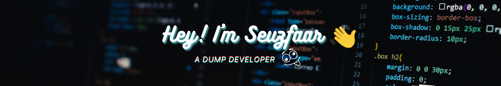

  

  

 
 

I'm here to present my work to people. Join me on my <a href="http://youtube.com/seuzfaar?sub_confirmation=1">YouTube channel</a> so we can geek out ❤️

 
 

- 🌟 Part of the <a href="https://discord.gg/SWhBEbMzW3">Likya Discord</a> Comminty
- ❤️ I love writing phyton, Javascript and building fun experiments on **U4** 
- 📸 I'm making a YouTube video for you <a href="http://youtube.com/seuzfaar?sub_confirmation=1">on my channel.</a> You can also learn something from it.

---

<a href="http://youtube.com/seuzfaar?sub_confirmation=1">
 <picture>
<source 
  srcset="https://github-readme-stats.vercel.app/api?username=Seuzfaar&show_icons=true&theme=transparent"
  media="(prefers-color-scheme: dark)"
/>
<source
  srcset="https://github-readme-stats.vercel.app/api?username=Seuzfaar&show_icons=true"
  media="(prefers-color-scheme: light), (prefers-color-scheme: no-preference)"
/>

</picture></a>

 
 

<a href="http://youtube.com/seuzfaar?sub_confirmation=1">
<picture>
<source 
  srcset="https://github-readme-stats.vercel.app/api/top-langs?username=seuzfaar&show_icons=true&locale=en&&langs_count=10&theme=transparent"
  media="(prefers-color-scheme: dark)"
/>
<source
  srcset="https://github-readme-stats.vercel.app/api/top-langs?username=seuzfaar&show_icons=true&locale=en&langs_count=10"
  media="(prefers-color-scheme: light), (prefers-color-scheme: no-preference)"
/>

</picture></a>
